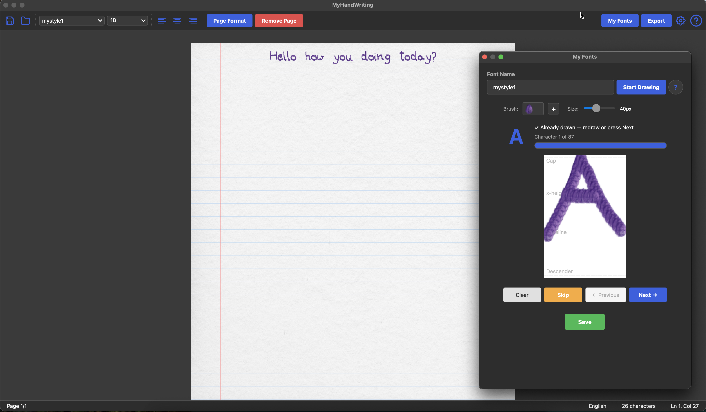

# MyHandWriting

> Turn your handwriting into a digital font and write documents that look hand-written.

[](images/Screenshot.jpg)

## What is MyHandWriting?

MyHandWriting is a desktop app that lets you create your own handwriting font by drawing each letter, then use it to write full documents that look like they were written by hand. Export your work as a PDF that looks like real handwritten pages — complete with paper textures, ruled lines, and your personal writing style.

## Features

- **Create Your Own Fonts** — Draw each character with customizable brush styles and sizes
- **Multiple Brush Options** — Black ball pen, blue ball pen, round soft brush, or import your own
- **Page Editor** — Write documents using your handwriting font with a familiar editor interface
- **Page Formatting** — Choose page size (A4, Letter, A3, A5), margins, paper textures, and line styles (Plain, Lined, Ruled, Grid)
- **Multi-Page Support** — Automatic page breaks when content fills a page
- **PDF Export** — Export your handwritten documents as PDF files
- **Save & Open** — Save your work in `.mhw` format and reopen it later
- **Dark & Light Themes** — Adapts to your system theme or choose manually
- **Cross-Platform** — Works on macOS, Windows, and Linux

## Download

Download the latest release from [GitHub Releases](https://github.com/bannyvishwas/MyHandWriting/releases).

## Quick Start

### 1. Install

```bash
# Clone the repo
git clone https://github.com/bannyvishwas/MyHandWriting.git
cd MyHandWriting

# Create virtual environment
python3 -m venv .venv
source .venv/bin/activate  # On Windows: .venv\Scripts\activate

# Install the app
pip install -e .
```

### 2. Run

```bash
myhandwriting
```

### 3. Create Your Font

1. Click **My Fonts** in the toolbar
2. Enter a name for your font and click **Start Drawing**
3. Draw each character on the canvas using the brush
4. Use **Next** to advance through all characters (you can skip any)
5. Click **Generate Font** when done

### 4. Write with Your Font

1. Select your font from the **Font dropdown** in the toolbar
2. Choose your **font size**
3. Start typing — your handwriting appears on the page
4. Use **Page Format** to customize the page look (texture, lines, margins)

### 5. Export as PDF

Click **Export** to save your document as a PDF file.

## How It Works

1. You draw each character (A-Z, a-z, 0-9, symbols) on a small canvas
2. The app saves each character as a processed image (smoothed and cropped)
3. When you type in the editor, the app inserts your character images instead of regular text
4. On export, the images are arranged on pages matching your page format settings

## Page Format Options

| Setting | Options |
|---------|---------|
| Page Size | A4, Letter, A3, A5 |
| Page Style | Plain, Lined, Ruled, Grid |
| Page Texture | Plain White, custom paper textures |
| Margins | Horizontal and Vertical (configurable) |
| Line Thickness | 1-10px |

## File Formats

- **`.mhw`** — Native document format (saves text, styling, and page format)
- **`.pdf`** — Export format for sharing and printing

## Settings

Access settings via the ⚙ icon in the toolbar:
- Theme (System Default, Dark, Light)
- Default font and size
- Default brush style and size
- Export format

## System Requirements

- Python 3.12 or later
- macOS, Windows, or Linux
- ~100MB disk space (including PyQt6)

## Building from Source

A cross-platform build script is included. You only need Python 3.12+ installed.

### Quick build (all platforms)

```bash
# Setup + build in one command
python build.py all
```

### Step by step

```bash
# 1. Install dependencies
python build.py setup

# 2. Run in development mode (optional, to test)
python build.py run

# 3. Build the executable
python build.py build

# 4. Clean build artifacts (optional)
python build.py clean
```

### Build output by platform

| Platform | Output | How to run |
|----------|--------|-----------|
| macOS | `dist/MyHandWriting.app` | `open dist/MyHandWriting.app` |
| Windows | `dist\MyHandWriting\MyHandWriting.exe` | Double-click the .exe |
| Linux | `dist/MyHandWriting/MyHandWriting` | `./dist/MyHandWriting/MyHandWriting` |

### Using Makefile (macOS/Linux only)

```bash
make all       # Setup + Build
make run       # Run in dev mode
make clean     # Remove artifacts
make help      # Show all targets
```

## Contributing

1. Fork the repo
2. Create your feature branch (`git checkout -b feature/my-feature`)
3. Commit your changes (`git commit -am 'Add my feature'`)
4. Push to the branch (`git push origin feature/my-feature`)
5. Create a Pull Request

For major changes, please open an issue first to discuss what you'd like to change.

## License

MIT License — see [LICENSE](LICENSE) for details.

## Author

[@bannyvishwas](https://github.com/bannyvishwas)
